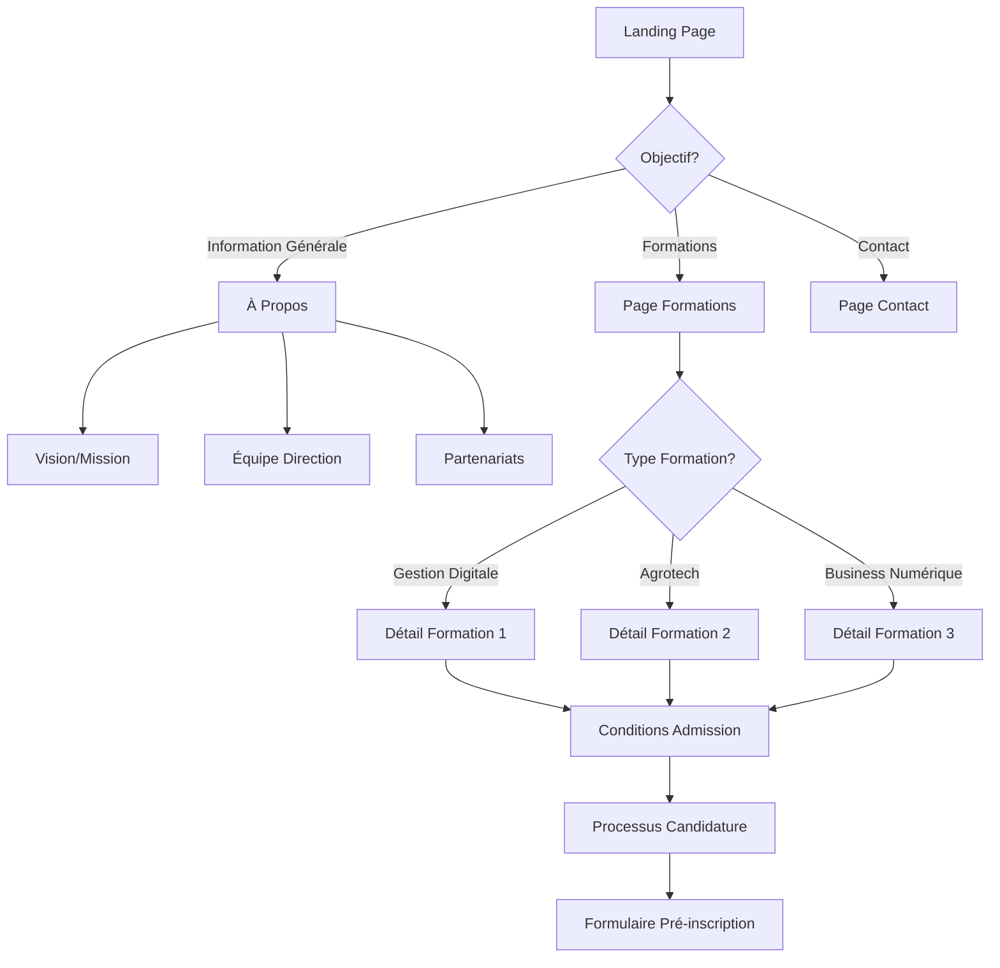
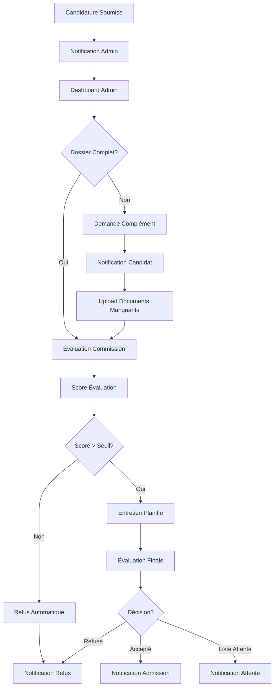
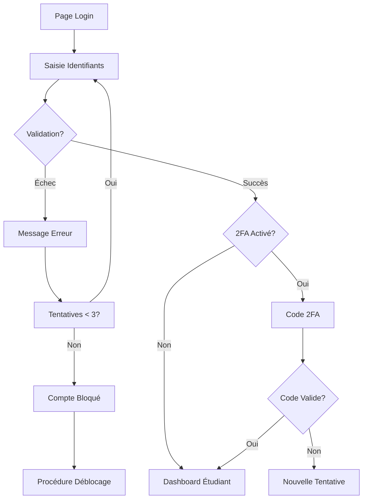
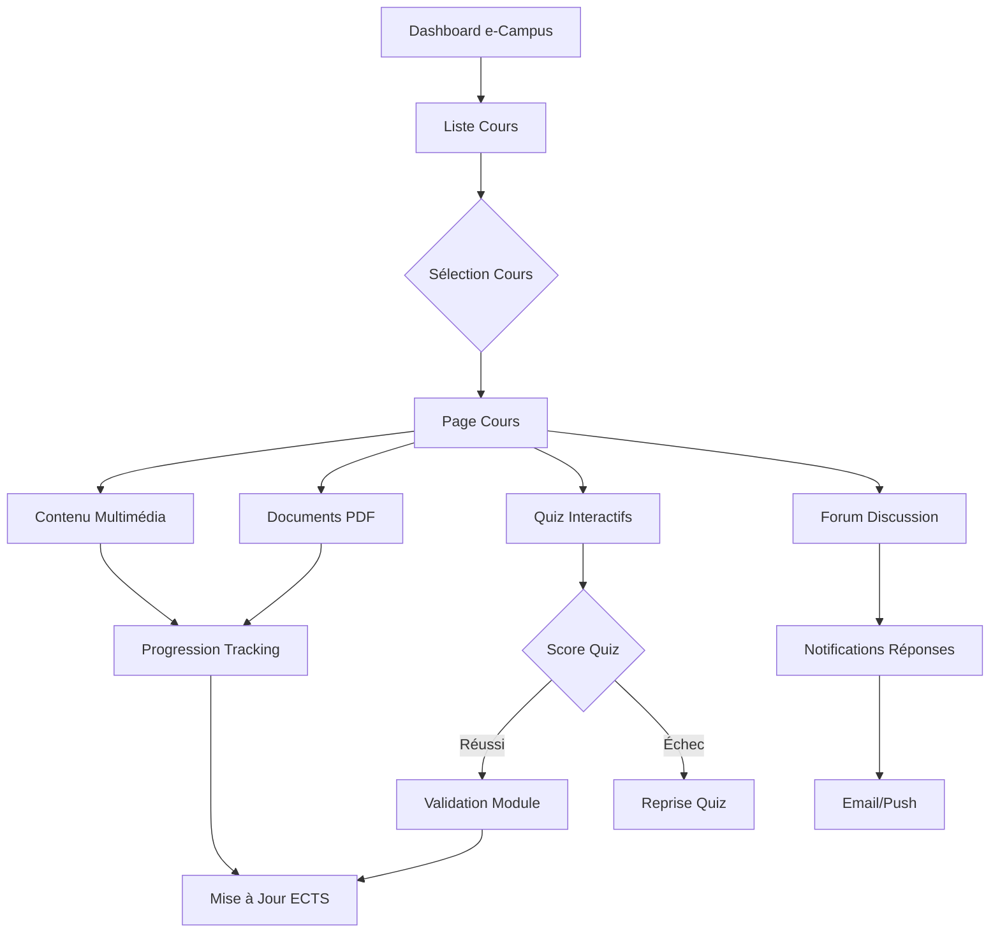
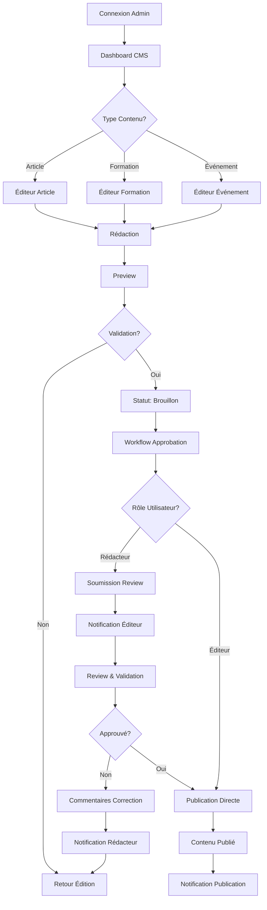
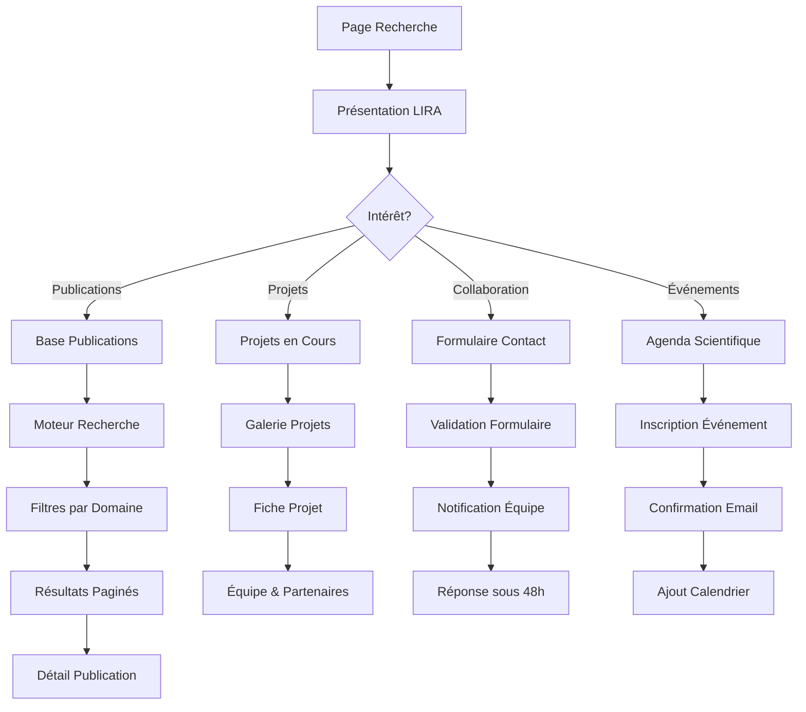
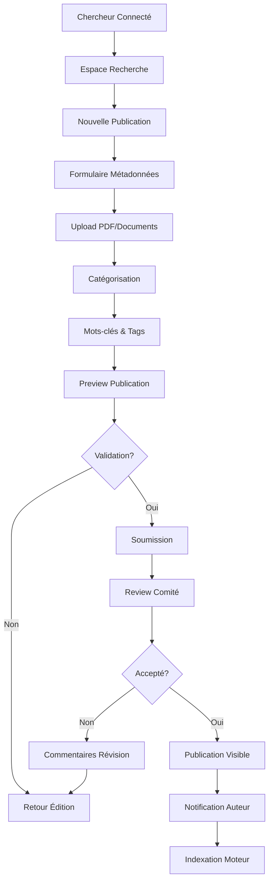

# App Flow Document
## Site Web Studia Sup - Flux Utilisateurs & Parcours

**Version :** 1.0  
**Date :** Juillet 2025  
**Document :** Application Flow & User Journey  
**Équipe :** UX/UI & Development Team  

---

## 1. Vue d'Ensemble des Flux

### 1.1 Typologie des Utilisateurs
- **Visiteur Anonyme** : Premier contact avec le site
- **Candidat Potentiel** : Recherche d'informations sur formations
- **Candidat Actif** : En processus de candidature
- **Étudiant Inscrit** : Accès portail authentifié
- **Administrateur** : Gestion contenu et candidatures
- **Partenaire** : Consultation informations institutionnelles

### 1.2 Flux Principaux Identifiés
1. **Découverte & Information** (Visiteur → Candidat Potentiel)
2. **Candidature & Admission** (Candidat → Étudiant)
3. **Vie Étudiante** (Étudiant → Alumni)
4. **Administration & Gestion** (Staff → Système)
5. **Partenariats & Recherche** (Externe → Collaboration)

---

## 2. Flux 1 : Découverte & Information

### 2.1 Parcours Visiteur Anonyme



**Points de Friction Identifiés :**
- Transition Information → Action (candidature)
- Clarté des prérequis par formation
- Accessibilité information tarifs

**Optimisations UX :**
- CTA clairs à chaque étape
- Progress indicators
- Comparateur de formations
- Chat bot d'aide

### 2.2 Navigation & Architecture

```
HEADER NAVIGATION
├── Accueil
├── À Propos
│   ├── Vision & Mission
│   ├── Gouvernance
│   ├── Équipe
│   └── Partenariats
├── Formations
│   ├── Gestion Digitale & IA
│   ├── Agrotech & IA Agricole
│   ├── Business Numérique
│   └── Comparateur
├── Admission
│   ├── Conditions
│   ├── Processus
│   ├── Candidater
│   └── Frais
├── Vie Étudiante
├── Recherche & Innovation
├── Actualités
└── Contact

FOOTER NAVIGATION
├── Liens Rapides
├── Formations
├── Services
├── Legal (CGU, Confidentialité)
└── Réseaux Sociaux
```

---

## 3. Flux 2 : Candidature & Admission

### 3.1 Processus de Candidature Complet

```mermaid
graph TD
    A[Page Formation] --> B[CTA "Candidater"]
    B --> C{Utilisateur Connecté?}
    C -->|Non| D[Création Compte]
    C -->|Oui| E[Dashboard Candidat]
    
    D --> F[Vérification Email]
    F --> E
    
    E --> G[Formulaire Candidature Étape 1]
    G --> H[Informations Personnelles]
    H --> I[Sauvegarde Auto]
    I --> J[Étape 2: Parcours Académique]
    J --> K[Upload Documents]
    K --> L[Étape 3: Motivation]
    L --> M[Lettre de Motivation]
    M --> N[Étape 4: Validation]
    N --> O[Récapitulatif]
    O --> P{Validation?}
    P -->|Non| Q[Retour Édition]
    P -->|Oui| R[Soumission]
    R --> S[Confirmation Email]
    S --> T[Statut: En Attente]
```

### 3.2 États de la Candidature

**Dashboard Candidat - États Possibles :**

1. **Brouillon** (Draft)
   - Candidature non soumise
   - Édition possible
   - Sauvegarde automatique
   - Indicateur de progression

2. **Soumise** (Submitted)
   - En attente de review
   - Notification email envoyée
   - Documents téléchargeables
   - Édition bloquée

3. **En Évaluation** (Under Review)
   - Dossier étudié par commission
   - Possibilité entretien planifié
   - Notifications de mise à jour
   - Timeline visible

4. **Acceptée** (Accepted)
   - Notification d'admission
   - Procédure d'inscription
   - Paiement frais de réservation
   - Accès informations pre-rentrée

5. **Refusée** (Rejected)
   - Notification avec motif
   - Possibilité de recours
   - Suggestion autres formations
   - Réorientation conseil

6. **En Attente** (Waitlist)
   - Position sur liste d'attente
   - Mise à jour automatique
   - Délai de réponse
   - Maintien de candidature

### 3.3 Workflow Administration des Candidatures



---

## 4. Flux 3 : Portail Étudiant Authentifié

### 4.1 Connexion & Authentification



### 4.2 Dashboard Étudiant - Navigation

```
PORTAIL ÉTUDIANT
├── 🏠 Accueil
│   ├── Résumé Académique
│   ├── Prochains Cours
│   ├── Notifications
│   └── Liens Rapides
├── 📚 e-Campus
│   ├── Cours en Ligne
│   ├── Ressources Vidéo
│   ├── Quiz & Évaluations
│   └── Devoirs à Rendre
├── 📊 Notes & Résultats
│   ├── Bulletins par Semestre
│   ├── Moyennes & Classements
│   ├── Progression ECTS
│   └── Relevés Officiels
├── 📖 Bibliothèque Numérique
│   ├── Livres IA & Tech
│   ├── Articles Recherche
│   ├── Bases de Données
│   └── Mes Favoris
├── 👥 Vie Étudiante
│   ├── Associations & Clubs
│   ├── Événements Campus
│   ├── Services Étudiants
│   └── Offres Stages
├── ⚙️ Mon Profil
│   ├── Informations Personnelles
│   ├── Paramètres Compte
│   ├── Préférences Notifications
│   └── Sécurité
└── 🔓 Déconnexion
```

### 4.3 Flux e-Campus & Apprentissage



---

## 5. Flux 4 : Administration & CMS

### 5.1 Workflow de Publication de Contenu



### 5.2 Gestion des Candidatures - Interface Admin

```
ADMIN CANDIDATURES
├── 📋 Dashboard
│   ├── Statistiques Temps Réel
│   ├── Candidatures par Statut
│   ├── Notifications Urgentes
│   └── Métriques Conversion
├── 👥 Liste Candidatures
│   ├── Filtres Avancés
│   ├── Tri Multi-Critères
│   ├── Actions en Lot
│   └── Export Données
├── 📄 Dossier Candidat
│   ├── Informations Complètes
│   ├── Documents Joints
│   ├── Historique Actions
│   └── Notes Évaluateurs
├── ✅ Évaluation & Scoring
│   ├── Grille d'Évaluation
│   ├── Score Automatique
│   ├── Commentaires
│   └── Recommandations
├── 📅 Planning Entretiens
│   ├── Calendrier Disponibilités
│   ├── Réservation Créneaux
│   ├── Notifications Auto
│   └── Visioconférence Intégrée
└── 📊 Rapports & Analytics
    ├── Statistiques Admission
    ├── Performance Canaux
    ├── Tendances Candidatures
    └── Export Rapports
```

---

## 6. Flux 5 : Recherche & Innovation

### 6.1 Parcours Chercheur/Partenaire



### 6.2 Soumission & Publication Recherche



---

## 7. Points de Conversion Critiques

### 7.1 Entonnoir de Conversion Principal

```
ÉTAPES DE CONVERSION
┌─────────────────┐    ┌─────────────────┐    ┌─────────────────┐
│   VISITEUR      │ →  │    PROSPECT     │ →  │    CANDIDAT     │
│                 │    │                 │    │                 │
│ • Landing Page  │    │ • Page Formation│    │ • Formulaire    │
│ • Navigation    │    │ • Détails Cours │    │ • Documents     │
│ • Information   │    │ • Conditions    │    │ • Soumission    │
└─────────────────┘    └─────────────────┘    └─────────────────┘
        │                        │                        │
        ▼                        ▼                        ▼
   Taux ~ 100%              Taux ~ 30%               Taux ~ 15%

┌─────────────────┐    ┌─────────────────┐    ┌─────────────────┐
│    ADMIS        │ ←  │   ÉVALUATION    │ ←  │    CANDIDAT     │
│                 │    │                 │    │                 │
│ • Notification  │    │ • Review Dossier│    │ • Statut Soumis │
│ • Inscription   │    │ • Entretien     │    │ • Attente       │
│ • Paiement      │    │ • Décision      │    │ • Tracking      │
└─────────────────┘    └─────────────────┘    └─────────────────┘
        │                        │                        │
        ▼                        ▼                        ▼
   Taux ~ 80%               Taux ~ 60%               Taux ~ 100%
```

### 7.2 Optimisations Identifiées

**Page d'Atterrissage :**
- Hero section avec value proposition claire
- Témoignages étudiants en évidence
- CTA multiple selon profil visiteur
- Trust signals (accréditations, partenaires)

**Pages Formations :**
- Comparateur interactif formations
- Calculateur de coût total
- Timeline du parcours étudiant
- Débouchés avec témoignages alumni

**Processus Candidature :**
- Barre de progression visible
- Sauvegarde automatique fréquente
- Aide contextuelle à chaque étape
- Validation temps réel des champs

---

## 8. Gestion des Erreurs & Edge Cases

### 8.1 Scénarios d'Erreur Communs

**Connexion & Authentification :**
```
Erreur Mot de Passe
├── Message Clair
├── Option "Mot de Passe Oublié"
├── Limitation Tentatives
└── Support Contact

Compte Inexistant
├── Suggestion Création Compte
├── Vérification Email
├── Redirection Inscription
└── Aide en Ligne

Session Expirée
├── Notification Avant Expiration
├── Sauvegarde Automatique
├── Reconnexion Transparente
└── Récupération Données
```

**Candidature & Upload :**
```
Fichier Trop Volumineux
├── Limite Clara Affichée
├── Compression Automatique
├── Upload Progressif
└── Formats Acceptés

Connexion Internet Instable
├── Upload par Chunks
├── Reprise Automatique
├── Mode Hors Ligne Partiel
└── Notification État Réseau

Formulaire Incomplet
├── Validation Temps Réel
├── Messages Erreur Contextuels
├── Sauvegarde Brouillon
└── Guide de Complétion
```

### 8.2 Fallback & Dégradation Gracieuse

**JavaScript Désactivé :**
- Formulaires fonctionnels en HTML pur
- Navigation de base opérationnelle
- Contenu accessible sans JS
- Message d'amélioration avec JS

**Connexion Lente :**
- Images optimisées/compressées
- Lazy loading intelligent
- Progressive enhancement
- Mode texte de secours

**Navigateurs Anciens :**
- Polyfills pour fonctionnalités critiques
- CSS de base compatible
- Fonctionnalités dégradées mais utilisables
- Message de mise à jour navigateur

---

## 9. Analytics & Tracking

### 9.1 Événements à Tracker

**Acquisition :**
- Source trafic (organic, social, direct, referral)
- Landing page première visite
- Campagnes marketing (UTM tracking)
- Géolocalisation visiteurs

**Engagement :**
- Pages vues par session
- Temps passé par page
- Scroll depth
- Clics sur CTA
- Téléchargements documents

**Conversion :**
- Démarrage candidature
- Progression formulaire par étape
- Abandon points de friction
- Soumission complète
- Taux acceptation finale

**Rétention :**
- Visiteurs récurrents
- Fréquence connexion portail étudiant
- Utilisation e-campus
- Engagement contenu

### 9.2 Dashboards Analytics

**Dashboard Executive :**
- KPIs globaux temps réel
- Tendances sur 30/90 jours
- Comparaison vs objectifs
- Alertes anomalies

**Dashboard Marketing :**
- Performance canaux acquisition
- Coût par candidature
- ROI campagnes
- Entonnoir conversion détaillé

**Dashboard Produit :**
- Usage des fonctionnalités
- Points de friction identifiés
- A/B tests résultats
- Feedback utilisateurs

---

## 10. Tests Utilisateurs & Validation

### 10.1 Protocole de Tests

**Tests Modérés :**
- 8 participants par persona
- Sessions 60 minutes
- Tâches réalistes prédéfinies
- Think-aloud protocol
- Enregistrement écran + audio

**Tests Non-Modérés :**
- 50 participants minimum
- Outils : Maze, UserTesting
- Tâches ciblées courtes
- Métriques quantitatives
- Heatmaps comportementales

**Tests A/B :**
- Variations pages clés
- Trafic 50/50 réparti
- Durée tests : 2 semaines minimum
- Significance statistique requise
- Implémentation gagnant

### 10.2 Métriques de Succès UX

**Usabilité :**
- Task completion rate : > 90%
- Time on task : Baseline à établir
- Error rate : < 5%
- Satisfaction score (SUS) : > 70

**Conversion :**
- Visitor-to-lead : > 5%
- Lead-to-application : > 15%
- Application completion : > 80%
- Overall funnel : > 0.6%

**Engagement :**
- Bounce rate : < 40%
- Pages per session : > 3
- Average session duration : > 3 min
- Return visitor rate : > 30%

---

**Validation Document :**

- [ ] **UX Designer** - Flux utilisateurs validés
- [ ] **Product Owner** - Business logic confirmé  
- [ ] **Tech Lead** - Faisabilité technique vérifiée
- [ ] **Marketing** - Entonnoir conversion approuvé
- [ ] **Studia Sup** - Parcours étudiants validés

**Prochaine Étape :** Tech Stack Document  
**Date Mise à Jour :** Juillet 2025