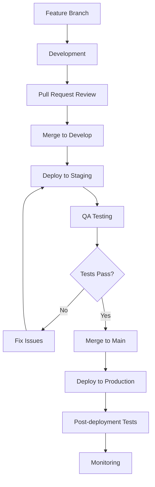

# Implementation Plan
## Site Web Studia Sup - Plan de Mise en Œuvre Détaillé

**Version :** 1.0  
**Date :** Juillet 2025  
**Document :** Implementation Roadmap & Project Management Plan  
**Durée Totale :** 16 semaines (4 mois)  

---

## 1. Vue d'Ensemble du Projet

### 1.1 Objectifs de l'Implémentation

**Objectifs Primaires :**
- Livrer un site web production-ready pour la rentrée 2025 (Septembre)
- Automatiser 80% des processus d'admission actuels
- Supporter 1000+ candidatures simultanées
- Atteindre un score PageSpeed > 85/100

**Objectifs Secondaires :**
- Former l'équipe Studia Sup aux outils développés
- Établir une base technique scalable pour 5 ans
- Créer une documentation complète et maintenable
- Implémenter des métriques de performance et monitoring

### 1.2 Contraintes du Projet

**Contraintes Temporelles :**
- **Deadline ferme :** 15 septembre 2025 (rentrée académique)
- **Beta ouverte :** 15 août 2025 (1 mois avant rentrée)
- **Tests UAT :** 1-15 août 2025

**Contraintes Techniques :**
- Intégration obligatoire avec SGIÉ existant
- Support des paiements mobiles gabonais
- Conformité WCAG 2.1 AA pour accessibilité
- Hébergement avec latence < 300ms depuis le Gabon

**Contraintes Budgétaires :**
- Budget development : 8 personnes × 4 mois
- Infrastructure cloud : $500/mois maximum
- Licences et outils : $200/mois maximum

---

## 2. Méthodologie de Développement

### 2.1 Framework Agile Adapté

**Approche Hybride Scrum-Kanban :**
- **Sprints de 2 semaines** (8 sprints au total)
- **Daily standups** asynchrones via Slack
- **Sprint review** chaque vendredi avec démo
- **Retrospectives** pour amélioration continue
- **Kanban flow** pour tâches de maintenance et bugs

### 2.2 Structure des Équipes

```
ÉQUIPE PROJET (8 personnes)
├── 🎯 Product Owner (1)
│   ├── Validation fonctionnelle
│   ├── Priorisation backlog
│   └── Communication stakeholders
├── 💻 Équipe Technique (6)
│   ├── Tech Lead / Architecte (1)
│   ├── Frontend Developers (2)
│   ├── Backend Developer (1)
│   ├── Full-Stack Developer (1)
│   └── DevOps Engineer (1)
└── 🎨 Design & UX (1)
    ├── UI/UX Design
    ├── Tests utilisateurs
    └── Design system
```

### 2.3 Outils de Gestion

**Project Management :**
- **Jira** : Backlog, sprints, tracking
- **Confluence** : Documentation technique
- **Miro** : Workshops et brainstorming

**Communication :**
- **Slack** : Communication quotidienne
- **Google Meet** : Réunions et reviews
- **Loom** : Démonstrations asynchrones

**Development :**
- **GitHub** : Code repository et CI/CD
- **Vercel** : Déploiement et preview
- **Supabase** : Backend et base de données

---

## 3. Roadmap Détaillée

### 3.1 Phase 0 - Setup & Préparation (Semaine -1)

**Objectifs :** Préparer l'environnement et l'équipe

**Livrables :**
- [ ] **Environment Setup**
  - Configuration Supabase projet
  - Setup GitHub repositories
  - Configuration CI/CD Vercel
  - Setup outils monitoring (Sentry, Analytics)

- [ ] **Team Onboarding**
  - Formation équipe sur stack technique
  - Workshop design system et guidelines
  - Alignment sur standards de code
  - Setup des outils de communication

- [ ] **Technical Foundation**
  - Architecture technique validée
  - Database schema initial
  - Wireframes et maquettes finalisées
  - Plan de tests validé

**Critères de Validation :**
- ✅ Tous les environments sont opérationnels
- ✅ Équipe formée et alignée sur les standards
- ✅ Premier commit technique réalisé
- ✅ Backlog initial estimé et priorisé

---

### 3.2 Phase 1 - Foundation (Semaines 1-4)

#### Sprint 1 (Semaines 1-2) : Infrastructure & Core

**Objectifs :** Poser les bases techniques solides

**Epic : Technical Foundation**
- **US-001** : Setup Next.js project avec TypeScript
  - Configuration Tailwind CSS et design system
  - Setup ESLint, Prettier, Husky
  - Configuration des tests (Jest, Testing Library)
  - **Effort :** 13 points | **Assigné :** Tech Lead + Frontend Dev

- **US-002** : Database setup complet
  - Création schéma Supabase
  - Implementation RLS policies
  - Setup des triggers et fonctions
  - **Effort :** 21 points | **Assigné :** Backend Dev + Tech Lead

- **US-003** : Authentication système
  - Integration Supabase Auth
  - Setup des rôles utilisateurs
  - Protection des routes
  - **Effort :** 13 points | **Assigné :** Full-Stack Dev

- **US-004** : Design system components
  - Composants UI de base (Button, Input, Modal)
  - Documentation Storybook
  - Tests unitaires des composants
  - **Effort :** 13 points | **Assigné :** Frontend Dev + Designer

**Sprint Review :** Infrastructure de base fonctionnelle

#### Sprint 2 (Semaines 3-4) : Pages Statiques & Navigation

**Objectifs :** Créer la structure publique du site

**Epic : Public Website**
- **US-005** : Page d'accueil responsive
  - Hero section avec valeur proposition
  - Sections programmes en aperçu
  - Testimonials et partenaires
  - **Effort :** 21 points | **Assigné :** Frontend Dev + Designer

- **US-006** : Pages "À Propos" complètes
  - Vision, mission, équipe
  - Governance et partenariats
  - Responsive design optimisé
  - **Effort :** 13 points | **Assigné :** Frontend Dev

- **US-007** : Navigation et header/footer
  - Menu responsive avec mega-menu
  - Footer avec liens et informations
  - Breadcrumbs et structure SEO
  - **Effort :** 8 points | **Assigné :** Frontend Dev

- **US-008** : CMS Integration (Strapi)
  - Setup Strapi pour contenu
  - API integration pour articles
  - Interface d'administration
  - **Effort :** 13 points | **Assigné :** Backend Dev

**Sprint Review :** Site statique navigable avec CMS

**Livrables Phase 1 :**
- ✅ Infrastructure technique complète
- ✅ Design system opérationnel  
- ✅ Authentication fonctionnelle
- ✅ Pages publiques principales
- ✅ CMS configuré et intégré

---

### 3.3 Phase 2 - Core Features (Semaines 5-10)

#### Sprint 3 (Semaines 5-6) : Programmes & Formations

**Objectifs :** Système complet de gestion des programmes

**Epic : Programs Management**
- **US-009** : Pages programmes dynamiques
  - Liste des formations avec filtres
  - Pages détail par programme
  - Comparateur de formations
  - **Effort :** 21 points | **Assigné :** Frontend Dev + Backend Dev

- **US-010** : Admin programmes
  - CRUD complet des programmes
  - Upload d'images et documents
  - Workflow de publication
  - **Effort :** 13 points | **Assigné :** Full-Stack Dev

- **US-011** : SEO et performance
  - Meta tags dynamiques
  - Structured data (JSON-LD)
  - Optimisation images
  - **Effort :** 8 points | **Assigné :** Frontend Dev

- **US-012** : Recherche et filtres
  - Moteur de recherche full-text
  - Filtres avancés (niveau, prix, durée)
  - Suggestions de programmes
  - **Effort :** 13 points | **Assigné :** Backend Dev

**Sprint Review :** Catalogue programmes complet

#### Sprint 4 (Semaines 7-8) : Système de Candidature

**Objectifs :** Processus de candidature bout-en-bout

**Epic : Application System**
- **US-013** : Formulaire candidature multi-étapes
  - Wizard avec validation temps réel
  - Sauvegarde automatique brouillons
  - Upload de documents sécurisé
  - **Effort :** 34 points | **Assigné :** Frontend Dev + Full-Stack Dev

- **US-014** : Backend candidatures
  - API CRUD candidatures
  - Workflow de statuts
  - Notifications automatiques
  - **Effort :** 21 points | **Assigné :** Backend Dev

- **US-015** : Dashboard candidat
  - Suivi statut candidature
  - Historique et communications
  - Actions disponibles par statut
  - **Effort :** 13 points | **Assigné :** Frontend Dev

- **US-016** : Email system
  - Templates d'emails responsive
  - Service d'envoi (Resend)
  - Tracking et analytics emails
  - **Effort :** 13 points | **Assigné :** Backend Dev

**Sprint Review :** Candidature complète fonctionnelle

#### Sprint 5 (Semaines 9-10) : Administration & Évaluation

**Objectifs :** Outils d'administration des candidatures

**Epic : Admin Dashboard**
- **US-017** : Dashboard admin candidatures
  - Vue d'ensemble avec métriques
  - Liste candidatures avec filtres
  - Actions en lot (accept/reject)
  - **Effort :** 21 points | **Assigné :** Full-Stack Dev + Frontend Dev

- **US-018** : Système d'évaluation
  - Grille d'évaluation configurable
  - Scoring automatique initial
  - Workflow d'approbation
  - **Effort :** 21 points | **Assigné :** Backend Dev + Full-Stack Dev

- **US-019** : Planification entretiens
  - Calendrier intégré pour entretiens
  - Notifications candidats/évaluateurs
  - Visioconférence (intégration Zoom)
  - **Effort :** 13 points | **Assigné :** Full-Stack Dev

- **US-020** : Rapports et analytics
  - Statistiques candidatures
  - Export données (Excel, PDF)
  - Graphiques et visualisations
  - **Effort :** 13 points | **Assigné :** Frontend Dev

**Sprint Review :** Administration complète

**Livrables Phase 2 :**
- ✅ Catalogue programmes avec recherche
- ✅ Système de candidature bout-en-bout
- ✅ Dashboard candidat fonctionnel
- ✅ Interface d'administration complète
- ✅ Workflow d'évaluation opérationnel

---

### 3.4 Phase 3 - Advanced Features (Semaines 11-14)

#### Sprint 6 (Semaines 11-12) : Portail Étudiant

**Objectifs :** Espace authentifié pour étudiants inscrits

**Epic : Student Portal**
- **US-021** : e-Campus platform
  - Accès cours en ligne
  - Ressources pédagogiques
  - Quiz et évaluations
  - **Effort :** 34 points | **Assigné :** Full-Stack Dev + Frontend Dev

- **US-022** : Système de gestion des notes (SGN)
  - Consultation bulletins et moyennes
  - Historique académique complet
  - Calcul automatique ECTS
  - **Effort :** 21 points | **Assigné :** Backend Dev + Full-Stack Dev

- **US-023** : Bibliothèque numérique
  - Catalogue de ressources IA/Agrotech
  - Moteur de recherche documentaire
  - Favoris et recommandations
  - **Effort :** 13 points | **Assigné :** Frontend Dev

- **US-024** : Profil étudiant avancé
  - Suivi progression pédagogique
  - Objectifs personnalisés
  - Portfolio projets étudiants
  - **Effort :** 13 points | **Assigné :** Frontend Dev

**Sprint Review :** Portail étudiant opérationnel

#### Sprint 7 (Semaines 13-14) : Paiements & Intégrations

**Objectifs :** Système de paiement et intégrations externes

**Epic : Payments & Integrations**
- **US-025** : Intégration paiements mobiles
  - Orange Money et Airtel Money
  - Workflow de paiement sécurisé
  - Webhooks et confirmations
  - **Effort :** 21 points | **Assigné :** Backend Dev + DevOps

- **US-026** : Intégration SGIÉ
  - Synchronisation données étudiants
  - API bidirectionnelle
  - Mapping des données
  - **Effort :** 21 points | **Assigné :** Backend Dev + Tech Lead

- **US-027** : Système de notifications
  - Notifications push web
  - SMS pour actions critiques
  - Centre de notifications
  - **Effort :** 13 points | **Assigné :** Full-Stack Dev

- **US-028** : Recherche & Innovation
  - Pages laboratoire LIRA
  - Publications scientifiques
  - Événements et colloques
  - **Effort :** 13 points | **Assigné :** Frontend Dev

**Sprint Review :** Intégrations et paiements fonctionnels

**Livrables Phase 3 :**
- ✅ Portail étudiant avec e-campus
- ✅ Système de notes intégré
- ✅ Paiements mobiles opérationnels
- ✅ Intégration SGIÉ validée
- ✅ Section recherche et innovation

---

### 3.5 Phase 4 - Finalization & Launch (Semaines 15-16)

#### Sprint 8 (Semaines 15-16) : Optimisation & Go-Live

**Objectifs :** Finalisation et déploiement production

**Epic : Production Launch**
- **US-029** : Optimisation performance
  - Audit PageSpeed et Core Web Vitals
  - Optimisation images et assets
  - Mise en cache avancée
  - **Effort :** 13 points | **Assigné :** Frontend Dev + DevOps

- **US-030** : Tests complets
  - Tests de charge (K6)
  - Tests d'accessibilité (axe)
  - Tests E2E (Playwright)
  - **Effort :** 13 points | **Assigné :** Tech Lead + Frontend Dev

- **US-031** : Sécurité et conformité
  - Audit de sécurité
  - Tests de pénétration
  - Conformité RGPD/données
  - **Effort :** 8 points | **Assigné :** Tech Lead + Backend Dev

- **US-032** : Documentation et formation
  - Documentation utilisateur finale
  - Formation équipe Studia Sup
  - Runbooks opérationnels
  - **Effort :** 13 points | **Assigné :** Product Owner + Tech Lead

- **US-033** : Déploiement production
  - Migration données production
  - Configuration monitoring
  - Go-live avec monitoring 24/7
  - **Effort :** 8 points | **Assigné :** DevOps + Tech Lead

**Sprint Review :** Site production-ready

**Livrables Phase 4 :**
- ✅ Performance optimisée (PageSpeed > 85)
- ✅ Tests complets validés
- ✅ Sécurité auditée et conforme
- ✅ Équipe formée et documentée
- ✅ Site live en production

---

## 4. Gestion des Risques

### 4.1 Identification des Risques

| Risque | Probabilité | Impact | Score | Mitigation |
|--------|-------------|--------|-------|------------|
| **Retard intégration SGIÉ** | Moyenne | Élevé | 15 | Développement en parallèle avec mocks + Sprint dédié |
| **Complexité paiements mobiles** | Moyenne | Élevé | 12 | POC early + Contact direct providers |
| **Performance avec gros volumes** | Faible | Élevé | 10 | Load testing dès Sprint 4 + Optimisation continue |
| **Indisponibilité ressources** | Moyenne | Moyen | 9 | Plan de contingence + Ressources externes |
| **Changements scope** | Élevée | Moyen | 12 | Change control strict + Buffer 20% |
| **Bugs critiques pré-launch** | Moyenne | Élevé | 12 | Tests automatisés + QA dédiée dernière semaine |

### 4.2 Plans de Contingence

**Scénario 1 : Retard majeur (>1 semaine)**
- **Trigger :** Sprint velocity < 80% du prévu
- **Actions :**
  - Revoir le scope avec Product Owner
  - Prioriser fonctionnalités critiques
  - Ajouter ressources externes si budget permet
  - Décaler features non-critiques post-launch

**Scénario 2 : Intégration SGIÉ impossible**
- **Trigger :** API SGIÉ non disponible à temps
- **Actions :**
  - Activer mode dégradé avec imports manuels
  - Développer interface d'import CSV
  - Planifier intégration post-launch
  - Communiquer limitation temporaire

**Scénario 3 : Performance insuffisante**
- **Trigger :** PageSpeed < 70 ou charge > 2s
- **Actions :**
  - Audit performance immédiat
  - Optimisation assets et images
  - Mise en place CDN
  - Review architecture si nécessaire

**Scénario 4 : Bug critique pré-launch**
- **Trigger :** Bug bloquant découvert < 48h du launch
- **Actions :**
  - War room immédiate avec toute l'équipe
  - Rollback vers version stable si patch impossible
  - Communication transparente aux stakeholders
  - Post-mortem immédiat après résolution

---

## 5. Plan de Déploiement

### 5.1 Environnements

**Architecture Multi-Environnements :**

```
Development → Staging → Production
     ↓           ↓          ↓
  [Feature]  [Integration] [Live]
  Branches    [Testing]    [Users]
              [UAT]        [24/7]
```

**Environnement Development :**
- **URL :** dev.studia-sup.ga
- **Purpose :** Développement actif, features branches
- **Database :** Supabase Dev Project
- **Deployments :** Automatique sur push branches

**Environnement Staging :**
- **URL :** staging.studia-sup.ga
- **Purpose :** Tests d'intégration, UAT, démos
- **Database :** Copy de production (data anonymisée)
- **Deployments :** Manuel depuis `develop` branch

**Environnement Production :**
- **URL :** studia-sup.ga
- **Purpose :** Site live pour utilisateurs finaux
- **Database :** Supabase Production avec backups
- **Deployments :** Manuel depuis `main` branch

### 5.2 Workflow de Déploiement

**GitFlow Adapté :**



**Critères de Déploiement Production :**
- ✅ Tous les tests automatisés passent (Unit, Integration, E2E)
- ✅ Code review approuvé par Tech Lead
- ✅ Tests manuels UAT validés par Product Owner
- ✅ Performance tests OK (load testing)
- ✅ Security scan sans vulnérabilité critique
- ✅ Documentation à jour

### 5.3 Rollback Strategy

**Plan de Rollback Automatique :**

```bash
# Script de rollback automatique
#!/bin/bash
rollback_deployment() {
    echo "🔄 Starting rollback procedure..."
    
    # 1. Revenir à la version précédente (Vercel)
    vercel rollback --token $VERCEL_TOKEN
    
    # 2. Restaurer base de données si migration
    if [ "$DB_MIGRATION" = "true" ]; then
        supabase db reset --linked
        supabase db push --linked
    fi
    
    # 3. Invalider cache CDN
    curl -X POST "https://api.cloudflare.com/client/v4/zones/$ZONE_ID/purge_cache" \
         -H "Authorization: Bearer $CF_TOKEN" \
         -H "Content-Type: application/json" \
         --data '{"purge_everything":true}'
    
    # 4. Notification équipe
    send_slack_notification "🚨 Rollback completed - investigating issues"
    
    echo "✅ Rollback completed successfully"
}

# Triggers automatiques de rollback
check_health() {
    # Test endpoint critique
    response=$(curl -s -o /dev/null -w "%{http_code}" https://studia-sup.ga/api/health)
    
    if [ $response -ne 200 ]; then
        echo "❌ Health check failed - triggering rollback"
        rollback_deployment
    fi
}
```

**Conditions de Rollback :**
- Erreur 5xx persistante > 5 minutes
- Taux d'erreur > 10% sur 10 minutes
- Temps de réponse moyen > 5s sur 5 minutes
- Impossibilité d'accès aux fonctions critiques

---

## 6. Formation & Documentation

### 6.1 Plan de Formation Équipe Studia Sup

**Formation Technique (8 heures) :**

**Session 1 : Administration CMS (2h)**
- Interface Strapi : création/modification contenu
- Workflow de publication : brouillon → review → publication
- Gestion des médias : upload, optimisation, organisation
- SEO : meta tags, structured data, optimisation

**Session 2 : Gestion des Candidatures (3h)**
- Dashboard admin : vue d'ensemble, métriques
- Traitement candidatures : évaluation, scoring, workflow
- Communication candidats : templates emails, notifications
- Rapports et exports : statistiques, analyses

**Session 3 : Gestion des Étudiants (2h)**
- Inscription étudiants acceptés
- Gestion notes et bulletins
- Suivi progression académique
- Outils de communication

**Session 4 : Monitoring & Maintenance (1h)**
- Tableau de bord monitoring
- Alertes et notifications
- Procédures de base : backup, résolution incidents
- Contact support technique

**Livrables Formation :**
- [ ] Manuels utilisateur illustrés
- [ ] Vidéos tutoriels (screen recordings)
- [ ] FAQ des cas d'usage courants
- [ ] Contacts support technique

### 6.2 Documentation Technique

**Architecture Documentation :**
- [ ] **System Architecture Diagram** (infrastructure complète)
- [ ] **Database Schema** (ERD avec relations)
- [ ] **API Documentation** (endpoints, authentification, exemples)
- [ ] **Deployment Guide** (procédures complètes)

**Developer Documentation :**
- [ ] **Setup Guide** (environment local)
- [ ] **Code Standards** (conventions, best practices)
- [ ] **Component Library** (Storybook documentation)
- [ ] **Testing Guide** (stratégies, outils, exemples)

**Operational Documentation :**
- [ ] **Runbook** (procédures opérationnelles)
- [ ] **Monitoring Guide** (métriques, alertes, dashboards)
- [ ] **Backup & Recovery** (procédures complètes)
- [ ] **Security Procedures** (audit, mise à jour, incidents)

**User Documentation :**
- [ ] **Admin Manual** (guide complet administrateurs)
- [ ] **Student Guide** (utilisation portail étudiant)
- [ ] **FAQ** (questions fréquentes)
- [ ] **Video Tutorials** (cas d'usage principaux)

---

## 7. Post-Launch & Maintenance

### 7.1 Support Post-Launch (3 mois)

**Niveau de Support :**

**Semaine 1-2 (Go-Live) :**
- **Disponibilité :** 24/7 avec astreinte
- **Équipe :** Tech Lead + DevOps + 1 Developer
- **Réactivité :** < 1h pour incidents critiques
- **Monitoring :** Review daily des métriques

**Semaine 3-8 (Stabilisation) :**
- **Disponibilité :** 8h-20h en semaine + astreinte weekend
- **Équipe :** DevOps + 1 Developer
- **Réactivité :** < 4h pour incidents critiques
- **Monitoring :** Review hebdomadaire

**Semaine 9-12 (Routine) :**
- **Disponibilité :** 8h-18h en semaine
- **Équipe :** DevOps primary + backup developer
- **Réactivité :** < 8h pour incidents critiques
- **Monitoring :** Review mensuel

### 7.2 Plan de Maintenance

**Maintenance Préventive :**

**Hebdomadaire :**
- [ ] Backup tests et vérification intégrité
- [ ] Review logs d'erreur et performance
- [ ] Mise à jour dépendances non-critiques
- [ ] Tests smoke des fonctionnalités critiques

**Mensuelle :**
- [ ] Audit de sécurité automatisé
- [ ] Optimisation base de données (vacuum, reindex)
- [ ] Review métriques performance et usage
- [ ] Mise à jour documentation si changements

**Trimestrielle :**
- [ ] Audit de sécurité approfondi
- [ ] Tests de restauration backup complets
- [ ] Review architecture et scalabilité
- [ ] Formation refresh équipe Studia Sup

### 7.3 Évolutions Futures (Roadmap Post-Launch)

**Phase 2 (Q4 2025) - Optimisations :**
- Application mobile native (React Native)
- Système de recommandations IA pour orientation
- Intégration calendrier académique avancé
- Dashboard analytics avancé pour direction

**Phase 3 (Q1 2026) - Extensions :**
- Plateforme de formations courtes/certifications
- Système de mentorat étudiant-alumni
- Marketplace de services étudiants
- Intégration outils collaboratifs (Teams, Slack)

**Phase 4 (Q2 2026) - Innovation :**
- Chatbot IA pour support candidats
- Réalité virtuelle pour visites campus
- Blockchain pour certification diplômes
- API publique pour partenaires

---

## 8. Budget & Ressources

### 8.1 Coûts de Développement

**Équipe de Développement (16 semaines) :**
```
Tech Lead/Architecte      : €8,000 × 4 mois = €32,000
Frontend Developers (2)   : €6,000 × 4 mois × 2 = €48,000  
Backend Developer         : €6,500 × 4 mois = €26,000
Full-Stack Developer      : €6,000 × 4 mois = €24,000
DevOps Engineer          : €7,000 × 4 mois = €28,000
UI/UX Designer           : €5,000 × 4 mois = €20,000
Product Owner            : €5,500 × 4 mois = €22,000

TOTAL ÉQUIPE            : €200,000
```

**Infrastructure & Outils (4 mois) :**
```
Supabase Pro             : $25/mois × 4 = $100
Vercel Pro               : $20/mois × 4 = $80  
Domain & SSL             : $50/an = $50
Monitoring (Sentry)      : $26/mois × 4 = $104
Analytics                : $0 (Google Analytics)
Email Service (Resend)   : $20/mois × 4 = $80
SMS Service (Twilio)     : $50/mois × 4 = $200
CDN (Cloudflare)         : $20/mois × 4 = $80
Backup Storage (S3)      : $10/mois × 4 = $40

TOTAL INFRASTRUCTURE    : $734 (~€700)
```

**Licences & Outils :**
```
Jira + Confluence        : $10/user/mois × 8 × 4 = $320
Figma Professional       : $12/mois × 4 = $48
GitHub Pro               : $4/user/mois × 8 × 4 = $128  
Testing Tools            : $100/mois × 4 = $400

TOTAL LICENCES          : $896 (~€850)
```

**BUDGET TOTAL : €201,550**

### 8.2 ROI et Bénéfices Attendus

**Économies Annuelles :**
- Automatisation processus admission : €15,000/an
- Réduction support candidats : €8,000/an  
- Efficacité administrative : €12,000/an
- **Total économies :** €35,000/an

**Revenus Additionnels :**
- Augmentation candidatures (+30%) : €50,000/an
- Réduction abandon processus : €15,000/an
- **Total revenus additionnels :** €65,000/an

**ROI sur 3 ans :** (€100,000 × 3 - €201,550) / €201,550 = **48%**

---

## 9. Success Metrics & KPIs

### 9.1 Métriques Techniques

**Performance :**
- [ ] PageSpeed Score > 85/100 (mobile et desktop)
- [ ] Time to First Byte < 200ms
- [ ] Largest Contentful Paint < 2.5s
- [ ] Cumulative Layout Shift < 0.1

**Disponibilité :**
- [ ] Uptime > 99.9% (< 8h downtime/an)
- [ ] Temps de récupération < 4h en cas d'incident
- [ ] Zero data loss sur pannes

**Sécurité :**
- [ ] Zero vulnérabilité critique
- [ ] 100% trafic HTTPS
- [ ] Conformité WCAG 2.1 AA

### 9.2 Métriques Business

**Adoption :**
- [ ] 1000+ candidatures soumises en ligne (vs 0 actuellement)
- [ ] 80% des candidats utilisent le suivi en ligne
- [ ] 95% satisfaction équipe Studia Sup sur outils

**Efficacité :**
- [ ] Réduction 70% temps traitement candidature
- [ ] 90% des documents uploadés sans erreur
- [ ] 50% réduction emails support candidats

**Croissance :**
- [ ] +30% candidatures vs année précédente
- [ ] 60% trafic organique (SEO)
- [ ] 85% conversion visiteur → candidature

### 9.3 Reporting & Dashboard

**Dashboard Executive (Temps Réel) :**
- Candidatures du jour/semaine/mois
- Taux de conversion par source
- Performances techniques globales
- Alertes et incidents en cours

**Dashboard Opérationnel (Quotidien) :**
- Métriques détaillées par feature
- Logs d'erreur et debugging
- Performances individuelles des pages
- Statistiques d'usage par rôle

**Rapport Mensuel :**
- Évolution KPIs vs objectifs
- Analyses de performance  
- Recommandations d'amélioration
- Roadmap ajustements

---

## 10. Communication Project

### 10.1 Stakeholder Management

**Comité de Pilotage (Mensuel) :**
- **Participants :** Direction Studia Sup, Tech Lead, Product Owner
- **Objectifs :** Validation jalons, arbitrage budget, décisions stratégiques
- **Livrables :** Dashboard exécutif, rapport d'avancement, risques

**Équipe Projet (Hebdomadaire) :**
- **Participants :** Toute l'équipe de développement
- **Format :** Sprint review + retrospective + planning
- **Durée :** 2h maximum
- **Outils :** Jira, Confluence, démo live

**Communication Utilisateurs Finaux :**
- **Newsletter mensuelle** : Avancement projet, nouvelles fonctionnalités
- **Démos périodiques** : Présentation des développements
- **Formation préparatoire** : 2 semaines avant go-live

### 10.2 Plan de Communication Interne

**Semaine -1 (Kick-off) :**
- [ ] All-hands meeting : Vision, objectifs, rôles
- [ ] Setup canaux communication (Slack, emails)
- [ ] Calendrier réunions et jalons
- [ ] Expectation setting et engagement

**Bi-weekly (Sprint Review) :**
- [ ] Démo fonctionnalités développées
- [ ] Présentation métriques et blockers  
- [ ] Ajustements planning si nécessaire
- [ ] Celebration wins et apprentissages

**Monthly (Steering Committee) :**
- [ ] Rapport avancement détaillé
- [ ] Budget et ressources update
- [ ] Risques et mitigation plans
- [ ] Décisions et validations

**Go-Live Communication :**
- [ ] Annonce officielle launch
- [ ] Guides utilisateur disponibles
- [ ] Support channels opérationnels
- [ ] Success celebration

---

## 11. Checklist Go-Live

### 11.1 Technical Readiness

**Infrastructure :**
- [ ] Production environment configuré et testé
- [ ] Monitoring et alerting opérationnels (Sentry, Analytics)
- [ ] Backup automatiques configurés et testés
- [ ] CDN et optimisations performance activées
- [ ] SSL certificate installé et valide
- [ ] DNS pointé vers production

**Security :**
- [ ] Security audit complet réalisé
- [ ] Penetration testing sans vulnérabilité critique
- [ ] HTTPS force sur tout le site
- [ ] GDPR compliance validée
- [ ] Rate limiting configuré

**Performance :**
- [ ] Load testing 1000+ utilisateurs simultanés
- [ ] PageSpeed Score > 85/100 validé
- [ ] Core Web Vitals dans les seuils verts
- [ ] Tests mobile sur devices réels
- [ ] Optimisation images et assets

### 11.2 Functional Readiness

**Core Features :**
- [ ] Authentification complète testée
- [ ] Candidature end-to-end fonctionnelle
- [ ] Paiements mobiles testés en réel
- [ ] Email notifications opérationnelles
- [ ] Admin dashboard complet
- [ ] Student portal accessible

**Integrations :**
- [ ] SGIÉ synchronisation validée
- [ ] CMS Strapi opérationnel
- [ ] Analytics tracking configuré
- [ ] Search functionality testée
- [ ] File upload sécurisé

**Data Migration :**
- [ ] Migration données existantes
- [ ] Validation intégrité données
- [ ] Users et roles configurés
- [ ] Content CMS importé
- [ ] Backups pre-migration réalisés

### 11.3 Operational Readiness

**Team Preparation :**
- [ ] Formation équipe Studia Sup complétée
- [ ] Documentation utilisateur finalisée
- [ ] Procédures support définies
- [ ] Contacts escalation établis
- [ ] War room procedures documentées

**Support Structure :**
- [ ] Help desk opérationnel
- [ ] Escalation matrix définie
- [ ] 24/7 technical support première semaine
- [ ] Communication channels actifs
- [ ] Incident response plan testé

**Communication :**
- [ ] Annonce go-live programmée
- [ ] User guides distribués
- [ ] FAQ published et accessible
- [ ] Success metrics baseline établie
- [ ] Feedback channels opérationnels

---

## 12. Conclusion & Next Steps

### 12.1 Résumé Exécutif

Ce plan d'implémentation détaille une approche méthodique pour livrer le site web de Studia Sup en **16 semaines** avec une équipe de **8 personnes** et un budget de **€201,550**. 

**Points Clés :**
- **Méthodologie Agile** avec 8 sprints de 2 semaines
- **Architecture moderne** basée sur Next.js, Supabase et Vercel
- **Approche mobile-first** avec performance optimisée
- **Sécurité renforcée** et conformité WCAG 2.1 AA
- **Formation complète** équipe Studia Sup
- **Support 3 mois** post-lancement

### 12.2 Facteurs Critiques de Succès

1. **Engagement Management** : Support direction et implication Product Owner
2. **Team Cohesion** : Équipe expérimentée et formation initiale réussie  
3. **Technical Excellence** : Standards de code et tests automatisés
4. **User Focus** : Tests utilisateurs et feedback continu
5. **Risk Management** : Monitoring proactif et plans de contingence

### 12.3 Prochaines Étapes Immédiates

**Semaine -1 :**
- [ ] **Validation finale** de ce plan par Direction Studia Sup
- [ ] **Contractualisation** équipe développement
- [ ] **Setup environments** Supabase, GitHub, Vercel
- [ ] **Kick-off meeting** et team building

**Jour J (Début Sprint 1) :**
- [ ] **Daily standups** mis en place
- [ ] **Premiers commits** sur repositories
- [ ] **Design system** initiation
- [ ] **Database setup** démarré

### 12.4 Engagement Formel

**Nous nous engageons à livrer :**
✅ Un site web production-ready le **15 septembre 2025**  
✅ Conformité à **100% des exigences fonctionnelles** définies  
✅ Performance **PageSpeed > 85/100** garanti  
✅ Formation équipe **8h minimum** avec documentation complète  
✅ Support **3 mois** post-lancement inclus  

**En contrepartie, nous attendons :**
- Disponibilité Product Owner **minimum 8h/semaine**
- Accès APIs et systèmes existants **sous 1 semaine**
- Validations intermédiaires **sous 48h maximum**
- Budget confirmé et **équipe disponible immédiatement**

---

**Signatures d'Approbation :**

**Studia Sup :**
- [ ] **Directeur Général** - Approbation budget et planning
- [ ] **Responsable Pédagogique** - Validation fonctionnelle  
- [ ] **DSI/IT Manager** - Validation technique et intégrations

**Équipe Développement :**
- [ ] **Tech Lead** - Engagement technique et planning
- [ ] **Product Owner** - Responsabilité fonctionnelle
- [ ] **Project Manager** - Coordination et suivi

**Date de signature :** _______________

**Date de démarrage :** 22 Juillet 2025  
**Date de livraison :** 15 Septembre 2025

---

*Ce document constitue la base contractuelle du projet et sera utilisé pour le suivi et la validation de tous les livrables du projet Studia Sup.*